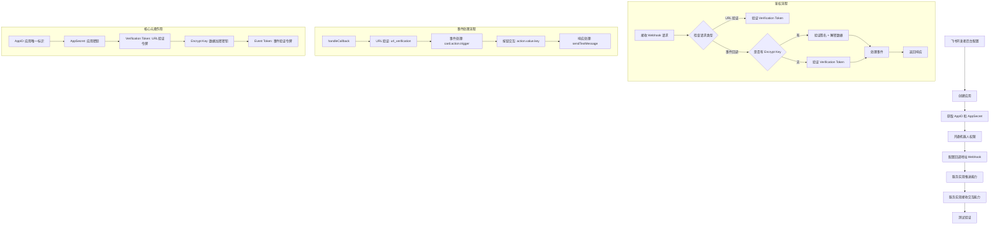

# 飞书 Node.js 集成技术文档

## 1. 接入流程图



### 1.1 核心元素说明

- **AppID**: 应用的唯一标识符，用于识别应用身份
- **AppSecret**: 应用密钥，用于获取访问令牌和验证请求
- **Verification Token**: URL验证令牌，用于验证回调地址的有效性
- **Encrypt Key**: 数据加密密钥，用于加密/解密事件数据（可选）
- **Event Token**: 事件验证令牌，用于验证事件来源的合法性

## 2. 配置方案

### 2.1 无 Encrypt Key 配置（简单模式）

**适用场景**: 开发测试、内部应用
**安全级别**: 基础安全

#### 配置步骤:
1. **飞书后台配置**:
   - 请求地址: `https://your-domain.com/api/callback`
   - 验证 Token: `your_verification_token`
   - 加密策略: **不启用**

2. **服务端配置**:
```typescript
// config/auth.ts
const authConfig = {
  appId: 'your_app_id',
  appSecret: 'your_app_secret',
  verificationToken: 'your_verification_token',
  enableEncryption: false,  // 关闭加密
  enableTokenValidation: true,
  enableSignatureValidation: false
};
```

#### 请求格式:
```json
{
  "type": "url_verification",
  "challenge": "test_challenge",
  "token": "your_verification_token"
}
```

### 2.2 有 Encrypt Key 配置（安全模式）

**适用场景**: 生产环境、企业应用
**安全级别**: 高级安全

#### 配置步骤:
1. **飞书后台配置**:
   - 请求地址: `https://your-domain.com/api/callback`
   - 验证 Token: `your_verification_token`
   - 加密策略: **启用**
   - 加密 Key: `your_encrypt_key`

2. **服务端配置**:
```typescript
// config/auth.ts
const authConfig = {
  appId: 'your_app_id',
  appSecret: 'your_app_secret',
  verificationToken: 'your_verification_token',
  encryptKey: 'your_encrypt_key',
  enableEncryption: true,  // 启用加密
  enableTokenValidation: true,
  enableSignatureValidation: true
};
```

#### 请求格式:
```json
{
  "encrypt": "base64_encoded_encrypted_data"
}
```

#### 加密原理:
1. 使用 SHA256 对 Encrypt Key 进行哈希，得到密钥 key
2. 使用 PKCS7Padding 方式将回调内容进行填充
3. 生成 16 字节的随机数作为初始向量 iv
4. 使用 iv 和 key 对回调内容加密，得到 encrypted_event
5. 应用收到的密文为 base64(iv+encrypted_event)

## 3. 核心代码实现

### 3.1 鉴权服务

```typescript
// services/AuthService.ts
import crypto from 'crypto';

export class AuthService {
  private readonly verificationToken: string;
  private readonly appSecret: string;
  private readonly encryptKey: string;
  private readonly config: any;

  constructor() {
    this.verificationToken = process.env.FEISHU_VERIFICATION_TOKEN;
    this.appSecret = process.env.FEISHU_APP_SECRET;
    this.encryptKey = process.env.FEISHU_ENCRYPT_KEY;
    this.config = {
      enableEncryption: process.env.ENABLE_ENCRYPTION !== 'false',
      enableTokenValidation: process.env.ENABLE_TOKEN_VALIDATION !== 'false'
    };
  }

  // 解密数据（仅在有 Encrypt Key 时使用）
  private decryptData(encryptedData: string): string {
    try {
      const encryptedBuffer = Buffer.from(encryptedData, 'base64');
      const iv = encryptedBuffer.slice(0, 16);
      const ciphertext = encryptedBuffer.slice(16);
      
      // 使用 SHA256 对 Encrypt Key 进行哈希，得到密钥 key
      const key = crypto.createHash('sha256').update(this.encryptKey).digest();
      
      const decipher = crypto.createDecipheriv('aes-256-cbc', key, iv);
      decipher.setAutoPadding(false);
      
      let decrypted = decipher.update(ciphertext, undefined, 'utf8');
      decrypted += decipher.final('utf8');
      
      // 移除 PKCS7 padding
      const paddingLength = decrypted.charCodeAt(decrypted.length - 1);
      if (paddingLength > 0 && paddingLength <= 16) {
        decrypted = decrypted.slice(0, decrypted.length - paddingLength);
      }
      
      return decrypted;
    } catch (error) {
      throw new Error(`Decryption failed: ${error.message}`);
    }
  }

  // 验证请求
  public validateRequest(req: any): AuthResult {
    try {
      const payload = req.body;

      if (!payload) {
        return { isValid: false, error: 'Empty request body' };
      }

      // 检查是否是加密请求
      if (payload.encrypted_data || payload.encrypt) {
        if (this.config.enableEncryption) {
          return this.validateEncryptedRequest(req);
        } else {
          return {
            isValid: false,
            error: 'Encrypted request received but encryption is not enabled'
          };
        }
      }

      // 非加密请求验证
      if (payload.type === 'url_verification') {
        return this.validateUrlVerification(payload);
      } else if (payload.schema === '2.0') {
        return this.validateEventCallback(payload);
      }

      return { isValid: false, error: 'Unknown request type' };
    } catch (error) {
      return {
        isValid: false,
        error: `Request validation error: ${error.message}`
      };
    }
  }

  // 验证加密请求
  public validateEncryptedRequest(req: any): AuthResult {
    try {
      const encryptedData = req.body.encrypted_data || req.body.encrypt;
      
      if (!encryptedData) {
        return {
          isValid: false,
          error: 'Missing encrypted_data or encrypt in request body'
        };
      }

      // 解密数据
      const decryptedData = this.decryptData(encryptedData);
      const payload = JSON.parse(decryptedData);

      // 验证解密后的数据
      if (payload.type === 'url_verification') {
        return this.validateUrlVerification(payload);
      } else if (payload.schema === '2.0') {
        return this.validateEventCallback(payload);
      }

      return { isValid: false, error: 'Invalid decrypted payload structure' };
    } catch (error) {
      return {
        isValid: false,
        error: `Encrypted request validation error: ${error.message}`
      };
    }
  }

  // 验证 URL 验证请求
  public validateUrlVerification(payload: any): AuthResult {
    if (!payload.token || payload.token !== this.verificationToken) {
      return { isValid: false, error: 'Invalid verification token' };
    }
    return { isValid: true, payload };
  }

  // 验证事件回调
  public validateEventCallback(payload: any): AuthResult {
    if (payload.header?.token !== this.verificationToken) {
      return { isValid: false, error: 'Invalid event token' };
    }
    return { isValid: true, payload };
  }
}
```

### 3.2 SDK 初始化

```typescript
// services/LarkService.ts
import { Client } from '@larksuiteoapi/node-sdk';

export class LarkService {
  public client: Client;

  constructor() {
    this.client = new Client({
      appId: process.env.FEISHU_APP_ID,
      appSecret: process.env.FEISHU_APP_SECRET,
    });
  }
}
```

### 3.3 消息推送

```typescript
// services/MessageService.ts
export class MessageService {
  private larkService: LarkService;

  constructor() {
    this.larkService = new LarkService();
  }

  // 发送文本消息
  public async sendTextMessage(openId: string, content: string): Promise<any> {
    return await this.larkService.client.im.message.create({
      params: { receive_id_type: 'open_id' },
      data: {
        receive_id: openId,
        content: JSON.stringify({ text: content }),
        msg_type: 'text',
      },
    });
  }

  // 发送卡片消息
  public async sendCardMessage(openId: string, cardContent: any): Promise<any> {
    return await this.larkService.client.im.message.create({
      params: { receive_id_type: 'open_id' },
      data: {
        receive_id: openId,
        content: JSON.stringify(cardContent),
        msg_type: 'interactive',
      },
    });
  }
}
```

### 3.4 Webhook 控制器

```typescript
// controllers/WebhookController.ts
import { Request, Response } from 'express';

export class WebhookController {
  private messageService: MessageService;
  private authService: AuthService;

  constructor() {
    this.messageService = new MessageService();
    this.authService = new AuthService();
  }

  public async handleCallback(req: Request, res: Response): Promise<void> {
    try {
      // 验证请求
      const authResult = this.authService.validateRequest(req);
      
      if (!authResult.isValid) {
        res.status(401).json({ error: authResult.error });
        return;
      }

      const payload = authResult.payload || req.body;

      // URL 验证处理
      if (payload.type === 'url_verification') {
        res.json({ challenge: payload.challenge });
        return;
      }

      // 事件回调处理
      if (payload.schema === '2.0' && payload.event) {
        const event = payload.event;
        
        switch (event.event_type) {
          case 'card.action.trigger':
            await this.handleCardInteraction(event);
            break;
        }
        
        res.json({ success: true });
        return;
      }

      res.status(400).json({ error: 'Invalid webhook payload' });
    } catch (error) {
      res.status(500).json({ error: 'Internal server error' });
    }
  }

  // 处理卡片交互
  private async handleCardInteraction(event: any): Promise<void> {
    const action = event.action;
    const openId = event.operator?.open_id;
    
    switch (action?.value?.key) {
      case 'test':
        await this.messageService.sendTextMessage(openId, '您点击了测试按钮！');
        break;
      case 'confirm':
        await this.messageService.sendTextMessage(openId, '操作已确认！');
        break;
    }
  }
}
```

### 3.5 卡片构建器

```typescript
// utils/CardBuilder.ts
export class CardBuilder {
  // 构建简单卡片
  public static buildSimpleCard(title: string, content: string, buttons?: any[]): any {
    const card: any = {
      config: { wide_screen_mode: true },
      header: { 
        title: { tag: "plain_text", content: title } 
      },
      elements: [
        {
          tag: "div",
          text: { tag: "plain_text", content }
        }
      ]
    };

    if (buttons && buttons.length > 0) {
      card.elements.push({
        tag: "action",
        actions: buttons
      });
    }

    return card;
  }
}
```

## 4. 环境变量配置

### 4.1 无 Encrypt Key 配置
```bash
# 基础配置
FEISHU_APP_ID=your_app_id
FEISHU_APP_SECRET=your_app_secret
FEISHU_VERIFICATION_TOKEN=your_verification_token

# 功能开关
ENABLE_ENCRYPTION=false
ENABLE_TOKEN_VALIDATION=true
ENABLE_SIGNATURE_VALIDATION=false
```

### 4.2 有 Encrypt Key 配置
```bash
# 基础配置
FEISHU_APP_ID=your_app_id
FEISHU_APP_SECRET=your_app_secret
FEISHU_VERIFICATION_TOKEN=your_verification_token
FEISHU_ENCRYPT_KEY=your_encrypt_key

# 功能开关
ENABLE_ENCRYPTION=true
ENABLE_TOKEN_VALIDATION=true
ENABLE_SIGNATURE_VALIDATION=true
```

## 5. 使用示例

### 5.1 发送文本消息

```typescript
const messageService = new MessageService();
await messageService.sendTextMessage(openId, 'Hello, 这是测试消息！');
```

### 5.2 发送卡片消息

```typescript
const card = CardBuilder.buildSimpleCard(
  '任务提醒',
  '您有一个新的任务需要处理',
  [
    {
      tag: "button",
      text: { tag: "plain_text", content: "查看详情" },
      type: "primary",
      value: { key: "view_details" }
    }
  ]
);

await messageService.sendCardMessage(openId, card);
```

## 6. 踩坑记录

### 6.1 权限配置问题
**问题**: 应用无法发送消息
**解决方案**: 确保开通机器人功能，配置 `im:message:send_as_bot` 权限

### 6.2 Webhook 配置问题
**问题**: 回调地址验证失败
**解决方案**: 确保回调地址支持 HTTPS，正确处理 `url_verification` 请求

### 6.3 用户 ID 问题
**问题**: 无法获取正确的用户 ID
**解决方案**: 使用 `open_id` 而不是 `user_id`

### 6.4 加密配置问题
**问题**: "Challenge code没有返回"
**解决方案**: 
1. 确保 Encrypt Key 正确配置
2. 确保服务端解密逻辑正确实现
3. 检查飞书后台加密策略设置

### 6.5 解密失败问题
**问题**: "Unexpected end of JSON input"
**解决方案**:
1. 确保使用 SHA256 对 Encrypt Key 进行哈希
2. 正确处理 PKCS7 padding
3. 验证 IV 和加密数据的正确拼接

## 7. 测试验证

### 7.1 无 Encrypt Key 测试
```bash
curl -X POST https://your-domain.com/api/callback \
  -H "Content-Type: application/json" \
  -d '{
    "type": "url_verification",
    "challenge": "test_challenge",
    "token": "your_verification_token"
  }'
```

### 7.2 有 Encrypt Key 测试
```bash
# 需要先加密数据，然后发送
curl -X POST https://your-domain.com/api/callback \
  -H "Content-Type: application/json" \
  -d '{
    "encrypt": "base64_encoded_encrypted_data"
  }'
```

## 8. 相关链接

- [飞书开放平台](https://open.feishu.cn/)
- [机器人开发指南](https://open.feishu.cn/document/server-docs/bot-v3/start)
- [Node.js SDK 文档](https://github.com/larksuite/oapi-sdk-nodejs)
- [加密策略说明](https://open.feishu.cn/document/server-docs/event-subscription-guide/encrypt)

---

**🎉 恭喜！您已成功实现飞书 Node.js 完整集成！**

**💡 提示**: 
- 开发测试建议使用无 Encrypt Key 配置，简化调试
- 生产环境建议使用有 Encrypt Key 配置，提高安全性 