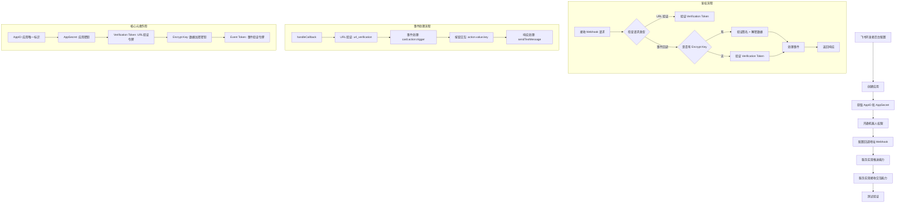

# 飞书 Node.js 集成技术文档

## 1. 接入流程图



### 1.1 核心元素说明

- **AppID**: 应用的唯一标识符，用于识别应用身份
- **AppSecret**: 应用密钥，用于获取访问令牌和验证请求
- **Verification Token**: URL验证令牌，用于验证回调地址的有效性
- **Encrypt Key**: 数据加密密钥，用于加密/解密事件数据（可选）
- **Event Token**: 事件验证令牌，用于验证事件来源的合法性

## 2. 基础配置

参考官方文档：
- [飞书开放平台](https://open.feishu.cn/)
- [机器人开发指南](https://open.feishu.cn/document/server-docs/bot-v3/start)

## 3. 核心代码实现

### 3.1 SDK 初始化

```typescript
// services/LarkService.ts
import { Client } from '@larksuiteoapi/node-sdk';

export class LarkService {
  private client: Client;

  constructor() {
    this.client = new Client({
      appId: process.env.FEISHU_APP_ID,
      appSecret: process.env.FEISHU_APP_SECRET,
    });
  }
}
```

### 3.2 消息推送

```typescript
// services/MessageService.ts
export class MessageService {
  private larkService: LarkService;

  constructor() {
    this.larkService = new LarkService();
  }

  // 发送文本消息
  public async sendTextMessage(openId: string, content: string): Promise<any> {
    return await this.larkService.client.im.message.create({
      params: { receive_id_type: 'open_id' },
      data: {
        receive_id: openId,
        content: JSON.stringify({ text: content }),
        msg_type: 'text',
      },
    });
  }

  // 发送卡片消息
  public async sendCardMessage(openId: string, cardContent: any): Promise<any> {
    return await this.larkService.client.im.message.create({
      params: { receive_id_type: 'open_id' },
      data: {
        receive_id: openId,
        content: JSON.stringify(cardContent),
        msg_type: 'interactive',
      },
    });
  }
}
```

### 3.3 Webhook 控制器

```typescript
// controllers/WebhookController.ts
import { Request, Response } from 'express';

export class WebhookController {
  private messageService: MessageService;

  constructor() {
    this.messageService = new MessageService();
  }

  public async handleCallback(req: Request, res: Response): Promise<void> {
    const payload = req.body;

    // URL 验证处理
    if (payload.type === 'url_verification') {
      res.json({ challenge: payload.challenge });
      return;
    }

    // 事件回调处理
    if (payload.schema === '2.0' && payload.event) {
      const event = payload.event;
      
      switch (event.event_type) {
        case 'card.action.trigger':
          await this.handleCardInteraction(event);
          break;
      }
      
      res.json({ success: true });
      return;
    }

    res.status(400).json({ error: 'Invalid webhook payload' });
  }

  // 处理卡片交互
  private async handleCardInteraction(event: any): Promise<void> {
    const action = event.action;
    const openId = event.operator?.open_id;
    
    switch (action?.value?.key) {
      case 'test':
        await this.messageService.sendTextMessage(openId, '您点击了测试按钮！');
        break;
      case 'confirm':
        await this.messageService.sendTextMessage(openId, '操作已确认！');
        break;
    }
  }
}
```

### 3.4 卡片构建器

```typescript
// utils/CardBuilder.ts
export class CardBuilder {
  // 构建简单卡片
  public static buildSimpleCard(title: string, content: string, buttons?: any[]): any {
    const card: any = {
      config: { wide_screen_mode: true },
      header: { 
        title: { tag: "plain_text", content: title } 
      },
      elements: [
        {
          tag: "div",
          text: { tag: "plain_text", content }
        }
      ]
    };

    if (buttons && buttons.length > 0) {
      card.elements.push({
        tag: "action",
        actions: buttons
      });
    }

    return card;
  }
}
```

## 4. 使用示例

### 4.1 发送文本消息

```typescript
const messageService = new MessageService();
await messageService.sendTextMessage(openId, 'Hello, 这是测试消息！');
```

### 4.2 发送卡片消息

```typescript
const card = CardBuilder.buildSimpleCard(
  '任务提醒',
  '您有一个新的任务需要处理',
  [
    {
      tag: "button",
      text: { tag: "plain_text", content: "查看详情" },
      type: "primary",
      value: { key: "view_details" }
    }
  ]
);

await messageService.sendCardMessage(openId, card);
```

## 5. 踩坑记录

### 5.1 权限配置问题
**问题**: 应用无法发送消息
**解决方案**: 确保开通机器人功能，配置 `im:message:send_as_bot` 权限

### 5.2 Webhook 配置问题
**问题**: 回调地址验证失败
**解决方案**: 确保回调地址支持 HTTPS，正确处理 `url_verification` 请求

### 5.3 用户 ID 问题
**问题**: 无法获取正确的用户 ID
**解决方案**: 使用 `open_id` 而不是 `user_id`

## 6. 相关链接

- [飞书开放平台](https://open.feishu.cn/)
- [机器人开发指南](https://open.feishu.cn/document/server-docs/bot-v3/start)
- [Node.js SDK 文档](https://github.com/larksuite/oapi-sdk-nodejs)

---

**🎉 恭喜！您已成功实现飞书 Node.js 完整集成！** 