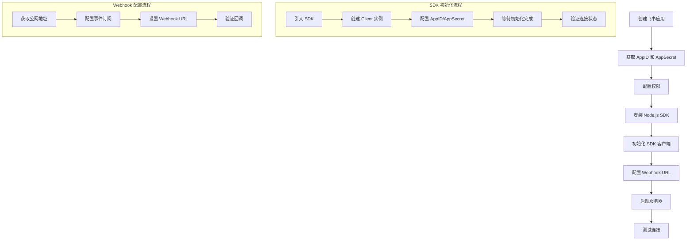

# 飞书 Node.js 集成技术文档

## 1. 如何实现 Node.js 接入飞书

### 1.1 接入流程图



### 1.2 环境准备

```bash
# 安装飞书 SDK
npm install @larksuiteoapi/node-sdk

# 安装 Web 框架
npm install express cors helmet
```

### 1.3 基础配置

```typescript
// config.ts
export interface LarkConfig {
  appId: string;
  appSecret: string;
  verificationToken: string;
}

const config: LarkConfig = {
  appId: 'your_app_id',
  appSecret: 'your_app_secret',
  verificationToken: 'your_verification_token'
};

export default config;
```

### 1.4 SDK 初始化

```typescript
// larkService.ts
import config from './config';

export class LarkService {
  private client: any = null;
  private initialized: boolean = false;

  constructor() {
    this.initializeClient();
  }

  private async initializeClient(): Promise<void> {
    try {
      const lark = require('@larksuiteoapi/node-sdk');
      
      this.client = new lark.Client({
        appId: config.appId,
        appSecret: config.appSecret,
      });
      
      // 等待 SDK 完全初始化
      await new Promise(resolve => setTimeout(resolve, 100));
      console.log('✅ 飞书 SDK 加载成功');
      this.initialized = true;
    } catch (error) {
      console.error('❌ 飞书 SDK 初始化失败:', error);
      throw error;
    }
  }

  public isSDKLoaded(): boolean {
    return this.client !== null && this.client.im !== undefined && this.initialized;
  }
}
```

## 2. 推送消息

### 2.1 推送文本消息

```typescript
// messageService.ts
export class MessageService {
  private client: any;

  constructor(client: any) {
    this.client = client;
  }

  public async sendTextMessage(receiveId: string, content: string): Promise<any> {
    if (!this.client) {
      throw new Error('Lark SDK not loaded');
    }

    const res = await this.client.im.message.create({
      params: {
        receive_id_type: 'user_id',
      },
      data: {
        receive_id: receiveId,
        content: JSON.stringify({ text: content }),
        msg_type: 'text',
      },
    });

    return res;
  }
}
```

### 2.2 推送卡片消息

```typescript
// cardMessageService.ts
export class CardMessageService {
  private client: any;

  constructor(client: any) {
    this.client = client;
  }

  public async sendCardMessage(receiveId: string, cardContent: any): Promise<any> {
    if (!this.client) {
      throw new Error('Lark SDK not loaded');
    }

    const cardData = {
      config: {
        wide_screen_mode: true
      },
      header: {
        title: {
          tag: "plain_text",
          content: cardContent.title || "卡片标题"
        }
      },
      elements: cardContent.elements || [
        {
          tag: "div",
          text: {
            tag: "plain_text",
            content: "卡片内容"
          }
        },
        {
          tag: "action",
          actions: [
            {
              tag: "button",
              text: {
                tag: "plain_text",
                content: "按钮文本"
              },
              type: "default",
              value: {
                key: "action_key"
              }
            }
          ]
        }
      ]
    };

    const result = await this.client.im.message.create({
      params: {
        receive_id_type: 'user_id',
      },
      data: {
        receive_id: receiveId,
        content: JSON.stringify(cardData),
        msg_type: 'interactive',
      },
    });

    return result;
  }
}
```

## 3. 接收卡片回调

### 3.1 Webhook 控制器

```typescript
// webhookController.ts
import { Request, Response } from 'express';

export class WebhookController {
  public async handleCallback(req: Request, res: Response): Promise<void> {
    try {
      const payload = req.body;
      
      // 处理 URL 验证
      if (payload.type === 'url_verification') {
        res.json({ challenge: payload.challenge });
        return;
      }

      // 处理事件回调 - 飞书使用 schema 2.0 格式
      if (payload.schema === '2.0' && payload.event) {
        const event = payload.event;
        
        switch (event.type) {
          case 'interactive':
            await this.handleCardInteraction(event);
            break;
          
          case 'card.action.trigger':
            await this.handleCardInteraction(event);
            break;
          
          case 'message':
            await this.handleMessage(event);
            break;
        }

        res.json({ success: true });
        return;
      }

      // 处理旧格式的事件回调
      if (payload.type === 'event_callback' && payload.event) {
        const event = payload.event;
        
        switch (event.type) {
          case 'interactive':
            await this.handleCardInteraction(event);
            break;
          
          case 'message':
            await this.handleMessage(event);
            break;
        }

        res.json({ success: true });
        return;
      }

      res.status(400).json({ error: 'Invalid webhook payload' });
    } catch (error) {
      console.error('Webhook processing failed:', error);
      res.status(500).json({ error: 'Webhook processing failed' });
    }
  }
}
```

### 3.2 卡片交互处理

```typescript
// cardInteractionHandler.ts
export class CardInteractionHandler {
  private client: any;

  constructor(client: any) {
    this.client = client;
  }

  public async handleCardInteraction(event: any): Promise<void> {
    try {
      const action = event.action;
      const userId = event.user_id || event.sender?.user_id;
      
      console.log('🔍 卡片交互详情:', JSON.stringify(action, null, 2));
      
      // 根据按钮值处理不同操作
      if (action?.value?.key === 'test') {
        await this.sendUserNotification(userId, '您点击了测试按钮！');
      } else if (action?.value?.key === 'confirm') {
        await this.sendToastNotification(userId, '操作已确认！');
      }
      
    } catch (error) {
      console.error('处理卡片交互失败:', error);
    }
  }

  private async sendUserNotification(userId: string, message: string): Promise<void> {
    if (!this.client) return;

    await this.client.im.message.create({
      params: {
        receive_id_type: 'user_id',
      },
      data: {
        receive_id: userId,
        content: JSON.stringify({ text: message }),
        msg_type: 'text',
      },
    });
  }

  private async sendToastNotification(userId: string, message: string): Promise<void> {
    if (!this.client) return;

    await this.client.im.message.create({
      params: {
        receive_id_type: 'user_id',
      },
      data: {
        receive_id: userId,
        content: JSON.stringify({ text: message }),
        msg_type: 'text',
      },
    });
  }
}
```

## 4. 踩坑记录

### 4.1 SDK 初始化问题

**问题**: SDK 初始化失败，client 对象为 null
**错误信息**: `Lark SDK not loaded`
**解决方案**: 
```typescript
// 添加延迟确保 SDK 完全初始化
await new Promise(resolve => setTimeout(resolve, 100));
```

### 4.2 卡片消息格式错误

**问题**: 卡片消息发送失败，格式不正确
**错误信息**: `Invalid card format`
**解决方案**: 
```typescript
// 使用正确的卡片格式
const cardContent = {
  config: { wide_screen_mode: true },
  header: { title: { tag: "plain_text", content: "标题" } },
  elements: [
    { tag: "div", text: { tag: "plain_text", content: "内容" } },
    { tag: "action", actions: [{ tag: "button", text: { tag: "plain_text", content: "按钮" }, type: "default", value: { key: "test" } }] }
  ]
};
```

### 4.3 Webhook 回调处理

**问题**: 无法正确解析 webhook 回调数据
**错误信息**: `Invalid webhook payload`
**解决方案**: 
```typescript
// 支持新旧两种格式
if (payload.schema === '2.0' && payload.event) {
  // 新格式处理
} else if (payload.type === 'event_callback' && payload.event) {
  // 旧格式处理
}
```

### 4.4 权限配置问题

**问题**: 应用无法发送消息
**错误信息**: `Permission denied`
**解决方案**: 
1. 确保应用有 `im:message` 权限
2. 确保应用已添加到群组
3. 检查 `receive_id` 是否正确

### 4.5 网络连接问题

**问题**: 无法连接到飞书服务器
**错误信息**: `Network error`
**解决方案**: 
1. 检查网络连接
2. 确认 AppID 和 AppSecret 正确
3. 检查防火墙设置

## 5. 相关链接

### 5.1 官方文档
- [飞书开放平台](https://open.feishu.cn/)
- [Node.js SDK 文档](https://github.com/larksuite/oapi-sdk-nodejs)
- [消息卡片格式](https://open.feishu.cn/document/common-capabilities/message-card/message-card-overview)

### 5.2 开发工具
- [飞书开发者后台](https://open.feishu.cn/app)
- [事件订阅配置](https://open.feishu.cn/document/server-docs/event-subscription-guide)

### 5.3 示例代码
- [官方示例](https://github.com/larksuite/oapi-sdk-nodejs/tree/main/sample)
- [Webhook 示例](https://github.com/larksuite/oapi-sdk-nodejs/tree/main/sample/webhook)

---

**🎉 恭喜！您已成功集成飞书 Node.js SDK！**

如有问题，请查看踩坑记录或参考官方文档。 