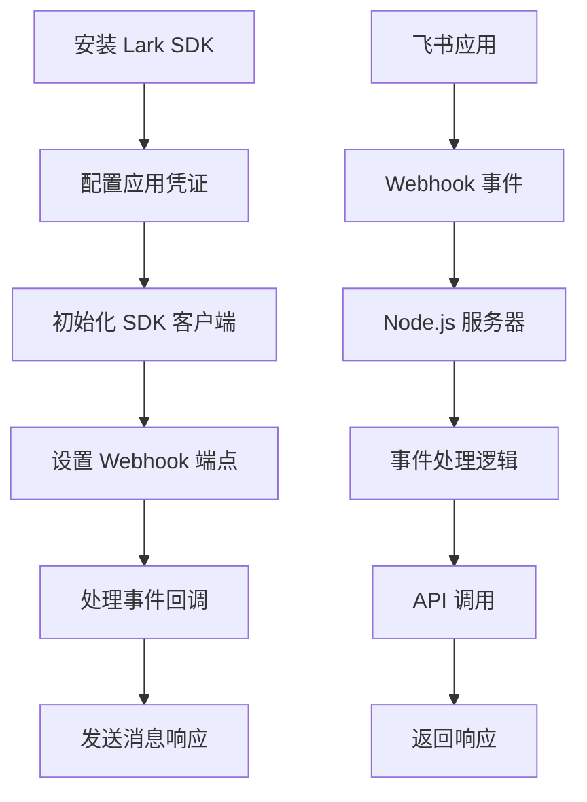

# Lark Node.js 集成技术文档

## 1. 如何实现 Node.js 接入 Lark

### 流程图


### 核心代码

#### 1.1 安装和初始化
```javascript
// 安装 SDK
npm install @larksuiteoapi/node-sdk

// 初始化客户端
import { Client } from '@larksuiteoapi/node-sdk';

const client = new Client({
  appId: 'cli_xxx',
  appSecret: 'xxx',
  disableTokenCache: false
});
```

#### 1.2 Webhook 服务器设置
```javascript
import express from 'express';
const app = express();

app.use(express.json());

// Webhook 端点
app.post('/api/callback', async (req, res) => {
  const payload = req.body;
  
  // URL 验证
  if (payload.type === 'url_verification') {
    res.json({ challenge: payload.challenge });
    return;
  }
  
  // 处理事件
  if (payload.schema === '2.0' && payload.event) {
    await handleEvent(payload.event);
    res.json({ success: true });
  }
});

app.listen(3000, () => {
  console.log('Webhook server running on port 3000');
});
```

## 2. 推送消息和卡片

### 2.1 推送文本消息
```javascript
async function sendTextMessage(chatId, content) {
  const response = await client.im.v1.message.create({
    data: {
      receive_id: chatId,
      receive_id_type: 'chat_id',
      content: JSON.stringify({ text: content }),
      msg_type: 'text'
    }
  });
  return response;
}
```

### 2.2 推送卡片消息
```javascript
async function sendCardMessage(chatId, cardContent) {
  const response = await client.im.v1.message.create({
    data: {
      receive_id: chatId,
      receive_id_type: 'chat_id',
      content: JSON.stringify(cardContent),
      msg_type: 'interactive'
    }
  });
  return response;
}

// 卡片内容示例
const cardContent = {
  config: { wide_screen_mode: true },
  header: {
    title: { tag: 'plain_text', content: '标题' }
  },
  elements: [
    {
      tag: 'div',
      text: { tag: 'plain_text', content: '内容' }
    },
    {
      tag: 'action',
      actions: [
        {
          tag: 'button',
          text: { tag: 'plain_text', content: '按钮' },
          type: 'default',
          value: { key: 'action' }
        }
      ]
    }
  ]
};
```

### 2.3 接收卡片回调
```javascript
async function handleCardInteraction(event) {
  if (event.action && event.action.value) {
    const buttonValue = event.action.value;
    const userId = event.operator?.user_id;
    
    // 处理按钮点击
    switch (buttonValue.key) {
      case 'confirm':
        await sendTextMessage(event.context.open_chat_id, '确认操作');
        break;
      case 'cancel':
        await sendTextMessage(event.context.open_chat_id, '取消操作');
        break;
    }
  }
}

// 事件处理
async function handleEvent(event) {
  switch (event.type) {
    case 'card.action.trigger':
      await handleCardInteraction(event);
      break;
    case 'message':
      // 处理普通消息
      break;
  }
}
```

## 3. 踩坑记录

### 3.1 Webhook URL 验证失败
**问题**: 返回数据不是合法的 JSON 格式
**解决**: 确保返回正确的 JSON 格式
```javascript
res.setHeader('Content-Type', 'application/json');
res.json({ challenge: payload.challenge });
```

### 3.2 卡片按钮点击失败
**问题**: 卡片按钮点击返回 400 错误
**解决**: 检查路由配置，确保调用正确的事件处理方法
```javascript
// 正确的路由配置
app.post('/api/callback', (req, res) => webhookController.handleCallback(req, res));
```

### 3.3 消息发送失败
**问题**: 消息发送返回权限错误
**解决**: 检查应用权限配置，确保有发送消息权限

### 3.4 事件处理异常
**问题**: 事件处理过程中服务器崩溃
**解决**: 添加 try-catch 错误处理
```javascript
try {
  await handleEvent(event);
  res.json({ success: true });
} catch (error) {
  console.error('Event processing failed:', error);
  res.json({ success: true, error: error.message });
}
```

## 4. 相关链接

- [Lark 开放平台文档](https://open.feishu.cn/document/)
- [Node.js SDK 文档](https://github.com/larksuite/oapi-sdk-nodejs)
- [消息卡片格式](https://open.feishu.cn/document/ukTMukTMukTM/ukTNwUjL5UDM14SO1ATN)
- [Webhook 事件格式](https://open.feishu.cn/document/ukTMukTMukTM/uYDNxYjL2QjM24iN0EjN)
- [应用权限配置](https://open.feishu.cn/document/ukTMukTMukTM/uQjN3QjL0YzN04CN2cDN)

---

**总结**: 通过以上步骤，可以快速实现 Node.js 与 Lark 的集成，支持消息推送、卡片交互和事件处理。 